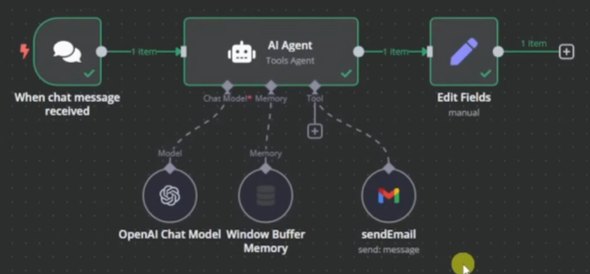

# 📧 Email agent in N8N
|  |
|:------------------------------------------:|

## 🤖 Create AI agent
- Click **'+ Add first step'**
   - Click **'AI agent'** and place

## ⚙️ Configure AI agent with Openai LLM + database + access to Gmail
- Three + icons under **'AI Agent'**

- Click on **'Chat Model'**:
    - Select **'OpenAI chat model'**
    - Credentials to connect with > Dropdown select **'Create New Credential' > Enter 'Openai API Key'** > ✔
    - Choose LLM model: gtp-4o-mini

- To remember previous chats we need memory so click on **'Memory'**:
    - Select **'Window Buffer Memory'**

- Click on **'Tool'**:
    - Select **'Gmail'**
    - Credentials to connect with > Dropdown select **'Create New Credential'** > ...enter_method_here... > ✔
    - Email Type: **'Text'**
    - Click **'To'** > Click **'Expression'** for dynamic chat email addresses > '{{' will generate options > {{ $fromAI("emailRecipient") }}
    - Click **'Subject'** > Click **'Expression'** > {{ $fromAI("emailRecipient") }}
    - Click **'Message'** > Click **'Expression'** > {{ $fromAI("emailBody") }}
    - Click on **'Add Option'** > Click **'Append n8n Attribution'** > toggle off > Removes the tag: **'Send by n8n from emails'**

- Click on the top left name for the windows **'Gmail'** to rename it to **'send_email'**, for use in other tools later.

## 🧠 Program AI Agent Logic
- Send to web ChatGPT: Upload image of ./send_email_workflow.PNG + 'Create a system prompt for an n8n 'AI agent', taking into considerations the tools attached based the image attached, that used the "send_email" tools to send emails based on the user's query. it is a helpful assistant that is friendly. As a system prompt for n8n, also add a tool called "contacts_database" that the agent will use to retrieve contact data such as names, email addresses and phone numbers. Please provide it as an easy to copy text snippet as your response.'
  - Click on **'AI Agent'** > **'Add Option'** > **'System Message'**
  - Click on **'Expression'** and click the **'enlarge button'** on the bottom right on the box.
  - Enter the system prompt ./system_prompt.txt into the expression text box.

## 📑 Add a contacts book (so emails can be sent by asking to email a particular person)
- Create a contacts book: Go to **'Google sheets'**
- Create a table of contacts with **'Name'**, **'Email'**, **'Phone Number'** 
- Name the Google spreadsheet: **'contacts_database'**

- Click on **'Tool'**  within the **'AI Agent'**
    - Click **'Google sheets'**
    - Credentials to connect with > Dropdown select **'Create New Credential'** > ...enter_method_here... > ✔

- Click on **'Tool'**
  - Click on **'Documents'** > Select **'contacts_database'**

- Click on the top left name for the windows **'Google Sheets'** to rename it to **'contacts_database'**, for use in other tools later.
  - Click on **'AI Agent'** > **'Add Option'** > **'System Message'**
  - Click on **'Expression'** and click the **'enlarge button'** on the bottom right on the box.
  - Enter the system prompt ./system_prompt.txt into the expression text box.

## 🚀 Run the program
- Test email > click on the **'When chat message received'** box and type in: "Can you send an email to <your_chosen_gmail_address> stating the top give performing tech stocks of today, the week and this month with ticker symbols and stock prices within a table format where the response data should be a text snippet".
  - Click on **'send_email'** then click on **'Operations'** to see the results!
  - ...Insert_image_of_results_table.png...